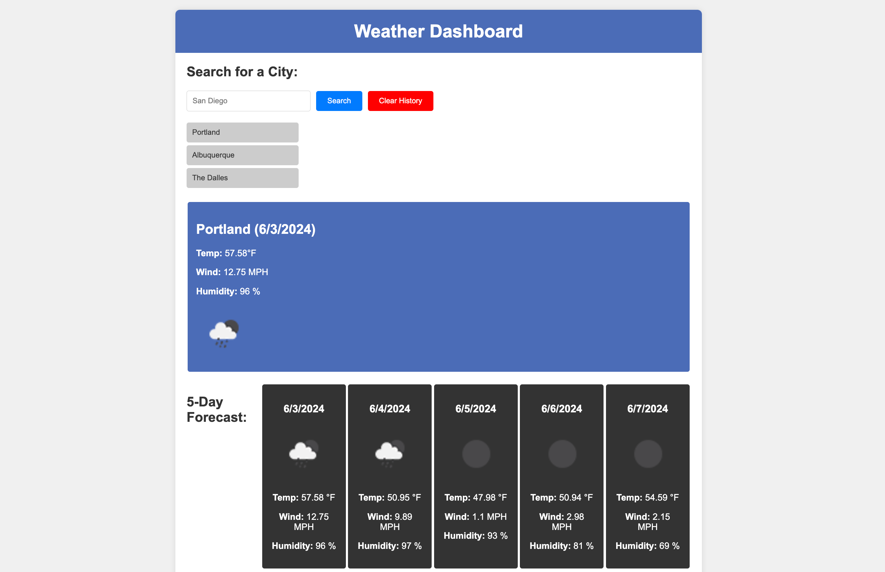

# Weather Dashboard Application

## Link to Deployed App

<https://rp192w.github.io/weather-dashboard/>

## Overview

This repository contains the code for a weather dashboard application that allows users to search for weather information by city. The application fetches and displays current weather and a 5-day forecast using the OpenWeatherMap API. It also maintains a search history stored in localStorage for quick access to previous searches.

## File Structure

### HTML Files

- **index.html**: The main page that displays the weather dashboard interface with sections for search input, current weather, and 5-day forecast.

### CSS Files

- **styles.css**: General styles for the weather dashboard application, including styles for the search section, weather display, and loading spinner.

### JavaScript Files

- **script.js**: Contains JavaScript code for handling city search, fetching weather data from the OpenWeatherMap API, displaying current weather and forecast, managing search history, and handling loading spinner visibility.

## Setup and Running

To run the application, go to the provided URL or clone the repo and open `index.html` in a web browser. Ensure your browser supports localStorage, which is required to persist search history.

## Weather Dashboard (index.html)

This page includes:

- **Search for a City**: An input field and search button to enter and search for a city's weather.
- **Current Weather**: Displays the current weather conditions including temperature, wind speed, humidity, and a weather icon.
- **5-Day Forecast**: Displays a 5-day weather forecast with daily temperature, wind speed, humidity, and weather icons.
- **Search History**: Displays a list of previously searched cities for quick access.

### Search Section

- **City Input**: Input field for entering the city name.
- **Search Button**: Initiates the search for weather data.
- **Clear History Button**: Clears the search history from localStorage.
- **Loading Spinner**: A loading spinner that appears while fetching weather data.

### Current Weather Display

- **Weather Card**: Shows current weather details such as temperature, wind speed, humidity, and a weather icon.

### 5-Day Forecast

- **Forecast Cards**: Each card shows the forecasted weather for a day including the date, temperature, wind speed, humidity, and a weather icon.

## Known Issues

- **LocalStorage**: Search history will not persist if localStorage is disabled in your browser. Check your browser settings if search history is not saving.

## Screenshots

